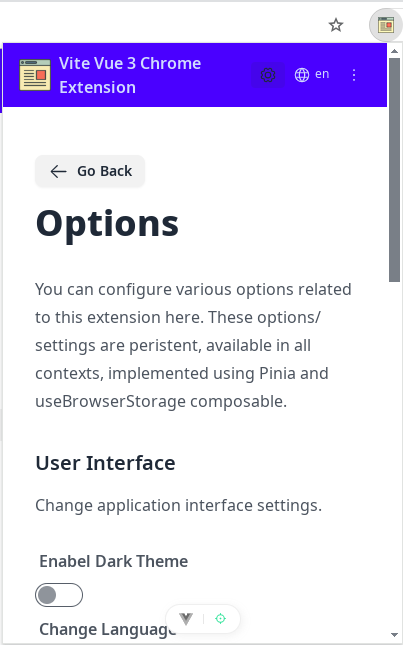
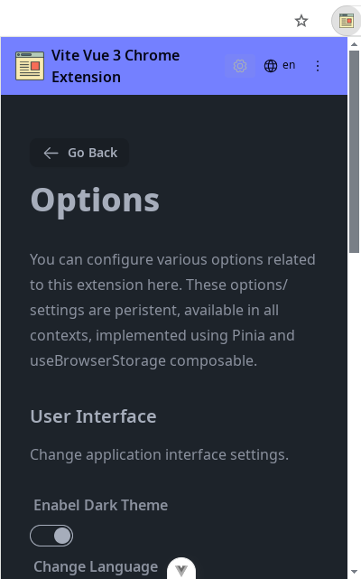
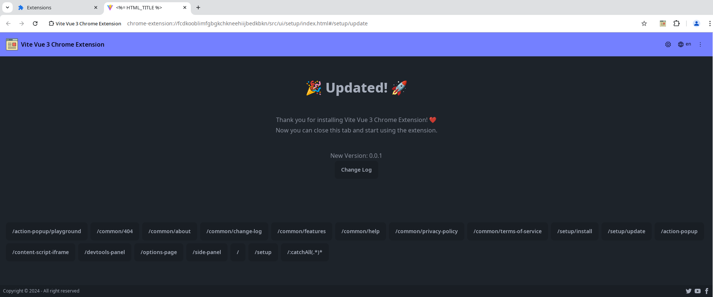
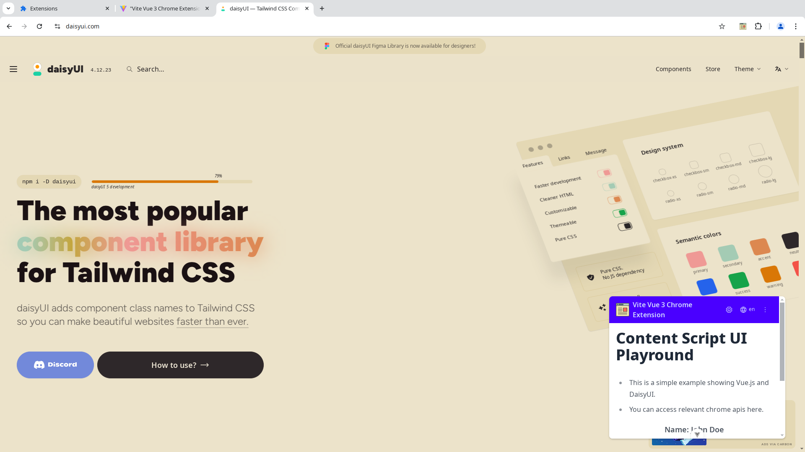

# vite-vue3-browser-extension-v3

[](https://github.com/mubaidr/vite-vue3-browser-extension-v3/actions/workflows/build.yml)

A [Vite](https://vitejs.dev/) powered WebExtension ([Chrome](https://developer.chrome.com/docs/extensions/reference/), [FireFox](https://addons.mozilla.org/en-US/developers/), etc.) starter template based on `manifest 3`, `vue3` and `vite` and alot more preconfigured.

## Screenshots

<p align="center">
    
    
    
</p>

<p align="center">
    
    
</p>

## Features

- Boiler plate Pages for
  - Background
  - Action Popup
  - Options
  - Content Script
  - Devtools panel
  - Browser Side Panel
  - Setup pages for Install and Update events
  - Offscreen pages for audio, screen recording etc
  - Sample pages for Contact, About, Pricing etc
- Dynamic/ Directory based routing. Just add a file in `src/pages` or relevant ui directory and it will be automatically registered as a route
- State & UI Components
  - Header
  - Footer
  - Locale Switch (i18n)
  - Theme Switch (dark/light)
  - Loading Spinner
  - Error Boundary
  - Empty State
  - Notifications using `notivue`
- Store for options preconfigured etc
- Composables for
  - i18n
  - Theme
  - Notifications
  - Loading
  - Error handling
  - `useBrowserStorage` for extension settings and user options management
- Preconfigured Pinia Store (optional perisitent and non-persistent)
  - System wide
  - Easily extendable
  - Type safe

_Please create an issue if you feel some feature is missing or could be improved._

## Directory Structure

```bash
.
├── dist                     # Built extension files
│   ├── chrome              # Chrome-specific build
│   └── firefox             # Firefox-specific build
├── public                  # Static assets
│   └── icons              # Extension icons
├── scripts                 # Build/dev scripts
├── src                     # Source code
│   ├── assets             # Global assets (images, styles)
│   ├── background         # Extension background script
│   ├── components         # Shared Vue components. Some prebuilt components are available like `Header`, `Footer`, `LocaleSwitch`, `ThemeSwitch`, `LoadingSpinner`, `ErrorBoundary`, `EmptyState` etc
│   ├── composables        # Vue composables/hooks
│   │   ├── useBrowserStorage  # Browser storage for both `sync` and `local`
│   │   ├── useLocale  # Manage locale in your extension
│   │   ├── useTheme  # Manage theme in your extension
│   ├── content-script     # Content scripts injected into pages
│   ├── devtools          # Chrome devtools panel
│   ├── locales           # i18n translation files
│   ├── offscreen         # Offscreen pages (audio, recording)
│   ├── stores            # Pinia stores
│   ├── types             # TypeScript type definitions
│   ├── ui                # UI pages
│   │   ├── action-popup  # Browser toolbar popup
│   │   ├── common        # Shared pages
│   │   ├── content-script-iframe        # Content script app injected into pages by content script
│   │   ├── devtools-panel # Devtools panel UI
│   │   ├── options-page  # Extension options
│   │   ├── setup        # Install/update pages
│   │   └── side-panel   # Browser side panel
│   └── utils            # Shared utilities
├── manifest.config.ts    # Base manifest configuration
├── vite.chrome.config.ts       # Chrome specific Vite configuration overrides
├── vite.config.ts       # Base Vite configuration
├── vite.firefox.config.ts       # Firefox specific Vite configuration overrides
├── tailwind.config.cjs  # Tailwind CSS configuration
└── package.json         # Project dependencies and scripts
```

## Development tools

### Vite Plugins

- [`unplugin-vue-router`](https://github.com/posva/unplugin-vue-router) - File system based route generator for Vite
- [`unplugin-auto-import`](https://github.com/antfu/unplugin-auto-import) - Directly use `browser` and Vue Composition API without importing
- [`unplugin-vue-components`](https://github.com/antfu/vite-plugin-components) - components auto import
- [`unplugin-icons`](https://github.com/antfu/unplugin-icons) - icons as components
- [`unplugin-turbo-console`](https://github.com/unplugin/unplugin-turbo-console) - Improve the Developer Experience of console
- [`@intlify/unplugin-vue-i18n`](https://github.com/intlify/bundle-tools/tree/main/packages/unplugin-vue-i18n) - unplugin for Vue I18n

### Vue Plugins

- [Pinia](https://pinia.vuejs.org/) - Intuitive, type safe, light and flexible Store for Vue
- [VueUse](https://github.com/antfu/vueuse) - collection of useful composition APIs
- [Notivue](https://github.com/smastrom/notivue) - Powerful toast notification system for Vue and Nuxt.
- [Vue-i18n](https://kazupon.github.io/vue-i18n/) - Internationalization plugin for Vue.js

### Plugins

- [Marked](https://github.com/markedjs/marked) - A markdown parser and compiler. Used for CHANGELOG.md to show in Update page

### UI Frameworks

- [tailwindcss](https://tailwindcss.com) - A utility-first CSS framework
- [daisyUI](https://daisyui.com/) - The most popular component library for Tailwind CSS

_Tailwind css `forms` and `typography` plugins are enabled for default styling of form controls._

### WebExtension Libraries

- [`webext-bridge`](https://github.com/zikaari/webext-bridge) - effortlessly communication between contexts
- [`webextension-polyfill`](https://github.com/mozilla/webextension-polyfill) - A lightweight polyfill library for Promise-based WebExtension APIs in Chrome

### Coding Style

- [TypeScript](https://www.typescriptlang.org/) - Typed JavaScript at Any Scale
- [ESLint](https://eslint.org/) - Linting utility for JavaScript and JSX
- [Prettier](https://prettier.io/) - Code formatter
- Use Composition API with [`<script setup>` SFC syntax](https://github.com/vuejs/rfcs/pull/227)
- Use Composition API with [`setup` SFC syntax](https://pinia.vuejs.org/cookbook/composables.html#Setup-Stores) in Pinia stores

## Use the Template

### GitHub Template

[Create a repo from this template on GitHub](https://github.com/mubaidr/vite-vue3-browser-extension-v3/generate).

### Clone to local

If you prefer to do it manually with the cleaner git history

> If you don't have pnpm installed, run: npm install -g pnpm

```bash
pnpx degit mubaidr/vite-vue3-browser-extension-v3 my-webext
cd my-webext
pnpm i
```

### Browser Related Configurations

- `manifest.config.ts` - Base extension manifest with common configuration
- `manifest.chrome.config.ts` - Chrome/ chromium based browsers specific manifest
- `manifest.firefox.config.ts` - Firefox spefic manifest
- `vite.config.ts` - Base vite configuration
- `vite.chrome.config.ts` - Chrome/ chromium based browsers specific vite configuration
- `vite.firefox.config.ts` - Firefox specific vite configuration

### Scripts

- `pnpm dev` - Start development server
- `pnpm build` - Build extension
- `pnpm lint` - Lint files

_You can also use pnpm dev:chrome, pnpm dev:firefox, pnpm build:chrome, pnpm build:firefox, pnpm lint:fix_

_Then load extension in browser with the `dist/` folder_

**Note**: Pack files under `dist/chrome` or `dist/firefox`, you can upload to appropriate extension store.

## Support

If you like this project, you can support me by donating [mubaidr](https://www.patreon.com/c/mubaidr) and starring ⭐ this repository.

## Hire me

I am a full stack developer. I am open to work. If you are looking for a developer or have a project you want to start, please visit my profile and website here: [mubaidr](https://mubaidr.js.org).

## Contributors

<!-- readme: collaborators,contributors -start -->
<table>
	<tbody>
		<tr>
            <td align="center">
                <a href="https://github.com/mubaidr">
                    
                    <br />
                    <sub><b>Muhammad Ubaid Raza</b></sub>
                </a>
            </td>
            <td align="center">
                <a href="https://github.com/Dreamlinerm">
                    
                    <br />
                    <sub><b>Dreamliner</b></sub>
                </a>
            </td>
            <td align="center">
                <a href="https://github.com/baramofme">
                    
                    <br />
                    <sub><b>Jihoon Yi</b></sub>
                </a>
            </td>
            <td align="center">
                <a href="https://github.com/poncianodiego">
                    
                    <br />
                    <sub><b>Diego Ponciano</b></sub>
                </a>
            </td>
            <td align="center">
                <a href="https://github.com/IgorFZ">
                    
                    <br />
                    <sub><b>igorfz</b></sub>
                </a>
            </td>
            <td align="center">
                <a href="https://github.com/hi2code">
                    
                    <br />
                    <sub><b>hi2code</b></sub>
                </a>
            </td>
		</tr>
		<tr>
            <td align="center">
                <a href="https://github.com/justorez">
                    
                    <br />
                    <sub><b>Null</b></sub>
                </a>
            </td>
		</tr>
	<tbody>
</table>
<!-- readme: collaborators,contributors -end -->
