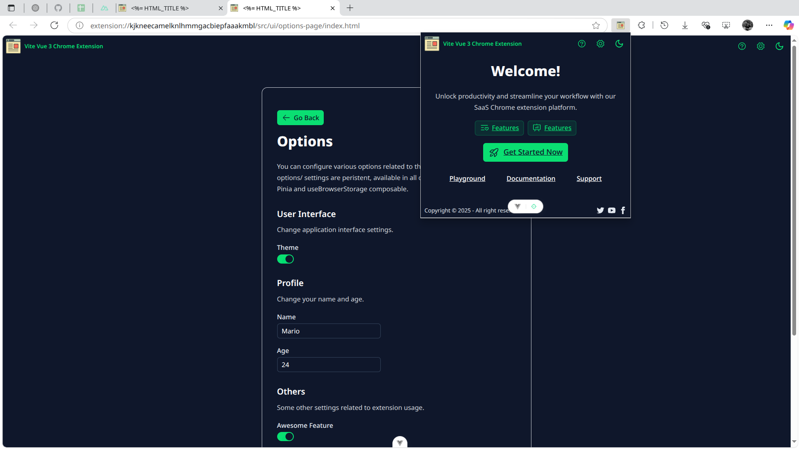
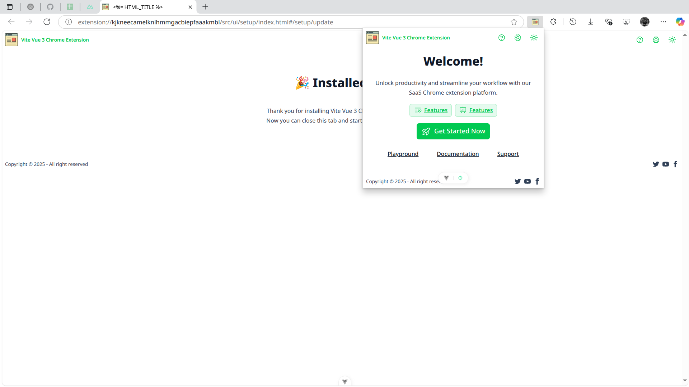
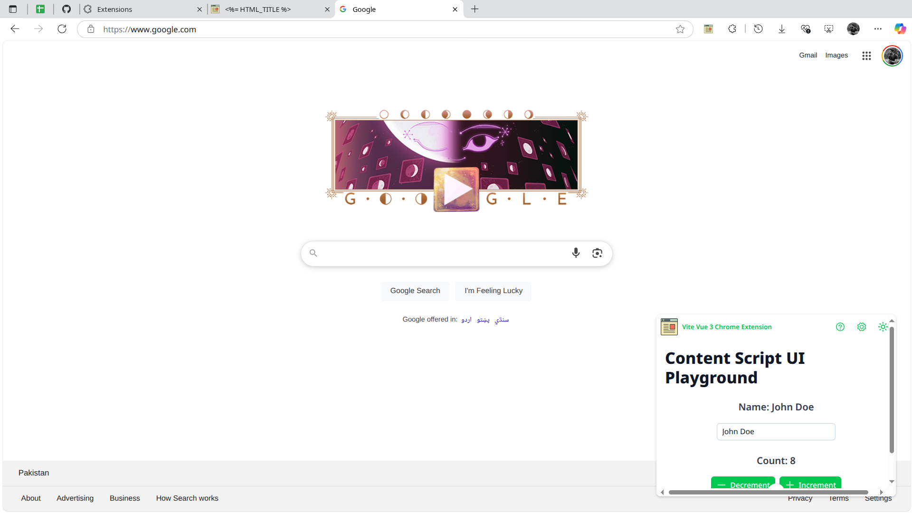

# Vite Vue 3 Browser Extension (Manifest V3)

[](https://github.com/mubaidr/vite-vue3-browser-extension-v3/actions/workflows/build.yml)

A modern, opinionated starter template for building browser extensions using [Vite](https://vitejs.dev/), [Vue 3](https://vuejs.org/), and Manifest V3. Supports Chrome, Firefox, and more. Includes pre-configured routing, state management, composables, and a rich set of UI components from Nuxt/UI v3. **Now with shadcn-vue support for additional component options!**

---

## 🚀 Features

- **Multi-Context Ready**: Boilerplate for background, popup, options, content script, devtools, side panel, and offscreen pages.
- **File-Based Routing**: Add a file in `src/pages` or relevant UI directory—auto-registered as a route.
- **Composable Architecture**: Prebuilt composables for i18n, theme, notifications, browser storage, and more.
- **State Management**: Type-safe Pinia stores (persistent & non-persistent).
- **UI Components**: Header, Footer, Locale & Theme Switch, Loading Spinner, Error Boundary, Empty State, Notifications, plus shadcn-vue components.
- **Modern Tooling**: Nuxt/UI 3, Tailwind CSS 4, ESLint, Prettier, auto-imports, and more.
- **WebExtension Utilities**: `webext-bridge` for context communication, `webextension-polyfill` for browser API compatibility.

---

## Screenshots





---

## 🛠️ Development

### Quick Start

```bash
npx degit mubaidr/vite-vue3-browser-extension-v3 my-webext
cd my-webext
npm install
npm run dev
```

- **Build**: `npm run build`
- **Lint**: `npm run lint`
- **Dev (Chrome/Firefox)**: `npm run dev:chrome` / `npm run dev:firefox`
- **Build (Chrome/Firefox)**: `npm run build:chrome` / `npm run build:firefox`

Load the extension from the `dist/chrome` or `dist/firefox` folder in your browser.

### Adding shadcn-vue Components

To add shadcn-vue components to your extension:

```bash
npx shadcn-vue@latest init
npx shadcn-vue@latest add button
npx shadcn-vue@latest add input
npx shadcn-vue@latest add card
```

The components will be automatically configured and ready to use in your Vue files.

---

## 🧩 Example: useBrowserStorage

```ts
const { data: syncSettings, promise } = useBrowserSyncStorage('settings', {
  theme: 'dark',
  notifications: true,
  preferences: { language: 'en', fontSize: 14 }
})

const { data: userProfile } = useBrowserLocalStorage('profile', {
  name: 'John Doe',
  lastLogin: null,
  favorites: ['item1', 'item2']
})

console.log(syncSettings.value.theme) // 'dark'
console.log(userProfile.value.name)   // 'John Doe'
```

---

## 🎨 shadcn-vue Integration

This template includes [shadcn-vue](https://www.shadcn-vue.com/) for additional high-quality, accessible components. The project is pre-configured with:

- **Component Installation**: Use `npx shadcn-vue@latest add <component>` to add components
- **Automatic Integration**: Components work seamlessly with existing Tailwind CSS setup
- **TypeScript Support**: Full type safety for all shadcn-vue components
- **Customizable**: Easy theming and customization through CSS variables

### Example: Adding a Button Component

```bash
npx shadcn-vue@latest add button
```

```vue
<template>
  <Button variant="default" size="sm" @click="handleClick">
    Click me
  </Button>
</template>

<script setup lang="ts">
import { Button } from '@/components/ui/button'

function handleClick() {
  console.log('Button clicked!')
}
</script>
```

---

## 🔌 Plugins & Libraries

- **Vite Plugins**: unplugin-vue-router, unplugin-auto-import, unplugin-vue-components, unplugin-icons, unplugin-turbo-console, @intlify/unplugin-vue-i18n
- **Vue Plugins**: Pinia, VueUse, Notivue, Vue-i18n
- **UI**: Nuxt/UI, shadcn-vue, Tailwind CSS 4
- **WebExtension**: webext-bridge, webextension-polyfill
- **Utilities**: Marked (for markdown rendering)
- **Coding Style**: TypeScript, ESLint, Prettier

---

## 📁 Directory Structure

```bash
.
├── dist/                # Built extension files (chrome/firefox)
├── public/              # Static assets (icons, etc.)
├── scripts/             # Build/dev scripts
├── src/                 # Source code
│   ├── assets/          # Global assets
│   ├── background/      # Background scripts
│   ├── components/      # Shared Vue components
│   ├── composables/     # Vue composables (hooks)
│   ├── content-script/  # Content scripts
│   ├── devtools/        # Devtools panel
│   ├── locales/         # i18n files
│   ├── offscreen/       # Offscreen pages
│   ├── stores/          # Pinia stores
│   ├── types/           # TypeScript definitions
│   ├── ui/              # UI pages (popup, options, etc.)
│   └── utils/           # Shared utilities
├── manifest.config.ts   # Base manifest config
├── vite.config.ts       # Base Vite config
├── tailwind.config.cjs  # Tailwind CSS config
└── package.json         # Dependencies & scripts
```

---

## 💡 Coding Style

- TypeScript with strict types
- ESLint & Prettier enforced
- Vue 3 Composition API (`<script setup>`)
- File-based routing and auto-imports

---

## 🤝 Contributing

Contributions are welcome! Please open issues or submit pull requests for improvements or new features.

---

## 🙏 Support

If you find this project useful, please consider [supporting the author](https://www.patreon.com/c/mubaidr) and starring ⭐ the repository.

---

## 👥 Contributors

<table>
<tbody>
<tr>
<td align="center">
<a href="https://github.com/mubaidr">

<br /><sub><b>Muhammad Ubaid Raza</b></sub>
</a>
</td>
<td align="center">
<a href="https://github.com/Dreamlinerm">

<br /><sub><b>Dreamliner</b></sub>
</a>
</td>
<td align="center">
<a href="https://github.com/baramofme">

<br /><sub><b>Jihoon Yi</b></sub>
</a>
</td>
<td align="center">
<a href="https://github.com/poncianodiego">

<br /><sub><b>Diego Ponciano</b></sub>
</a>
</td>
<td align="center">
<a href="https://github.com/IgorFZ">

<br /><sub><b>igorfz</b></sub>
</a>
</td>
<td align="center">
<a href="https://github.com/hi2code">

<br /><sub><b>hi2code</b></sub>
</a>
</td>
<td align="center">
<a href="https://github.com/justorez">

<br /><sub><b>Null</b></sub>
</a>
</td>
</tr>
</tbody>
</table>
